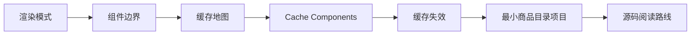

## 这套教程适合谁

你不需要已经精通 Next.js，但最好具备这些基础：React 组件、异步数据读取、HTTP 请求、npm 脚本，以及能读懂一些 TypeScript 代码。

这套教程默认读者已经知道“写一个 React 页面”是什么，但还没有把“Server Component、Client Component、缓存、Streaming、失效、构建输出”串成一个完整系统。

## 你会学到什么

## 站点中的代码

渐进式 Demo 讲解位于 `docs/demos/`，最终项目位于 `examples/minimal-next-cache/`。

你可以先读概念，再运行代码；也可以反过来，先跑起来观察构建输出，再回头看解释。

## 推荐学习方式

| 阶段 | 目标 | 入口 |
| --- | --- | --- |
| 学习路线 | 先知道全局怎么走 | [运行与学习路线](/quick-start) |
| 核心原理 | 建立渲染与缓存心智模型 | [渲染模式总览](/concepts/rendering-models) |
| 渐进式 Demo | 一次只验证一个机制 | [Demo 01](/demos/demo-01-static-server) |
| 最终项目 | 从零把机制组合起来 | [从零实现路线](/practice/build-00-roadmap) |
| 来源 | 回到官方文档和源码 | [官方资料](/reference/resources) |

## 内容基准

本教程基于 2026-05-29 可见的 Next.js 官方文档整理。Next.js 的缓存 API 演进很快，真实项目请优先核对官方文档和当前依赖版本。
