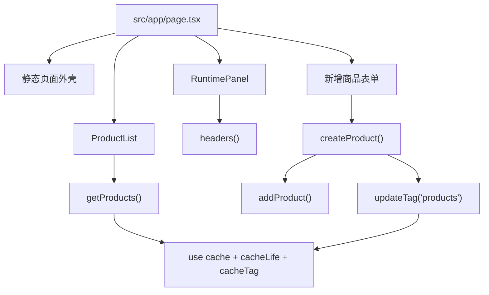

# 最小实战项目总览

最终项目是一个最小商品目录应用，技术栈是 Next.js App Router + TypeScript。

它不是为了展示完整业务功能，而是为了把渲染与缓存机制压缩到一个足够小、能反复观察的教学项目里。

## 功能目标

| 功能 | 是否实现 | 说明 |
| --- | --- | --- |
| 静态页面外壳 | 是 | 首页主体尽量保持可预渲染 |
| 动态请求信息 | 是 | 读取 `headers()`，演示请求时动态区域 |
| Streaming | 是 | 用 `<Suspense>` 包住动态区和慢数据区 |
| 缓存商品列表 | 是 | 用 `'use cache'`、`cacheLife`、`cacheTag` |
| 新增商品表单 | 是 | 用 Server Action 修改内存数据 |
| Tag 失效 | 是 | 用 `updateTag('products')` 让列表立即过期 |
| 构建验收 | 是 | 通过 `next build` 观察 PPR 输出 |

## 架构



## 和前面 Demo 的关系

| 机制 | Demo | 最终项目 |
| --- | --- | --- |
| Server Component | Demo 01 | `src/app/page.tsx` |
| Streaming | Demo 02 | `<Suspense>` 包住动态区 |
| Cache Components | Demo 03 | `src/lib/catalog.ts` |
| Tag 失效 | Demo 04 | `src/app/actions.ts` |

## 目录

```text
examples/minimal-next-cache/
├─ src/
│  ├─ app/
│  │  ├─ actions.ts
│  │  ├─ globals.css
│  │  ├─ layout.tsx
│  │  └─ page.tsx
│  ├─ components/
│  │  └─ Counter.tsx
│  └─ lib/
│     └─ catalog.ts
├─ next.config.ts
├─ package.json
└─ tsconfig.json
```

## 两种学习方式

你可以直接运行完整项目：

```bash
npm run example:dev
```

也可以按后面的 Step 从空目录手写一遍。推荐第二种，因为缓存问题只有自己拆开观察，才真的会记住。

## 分步教程

从这里开始：[从零实现路线](/practice/build-00-roadmap)。

